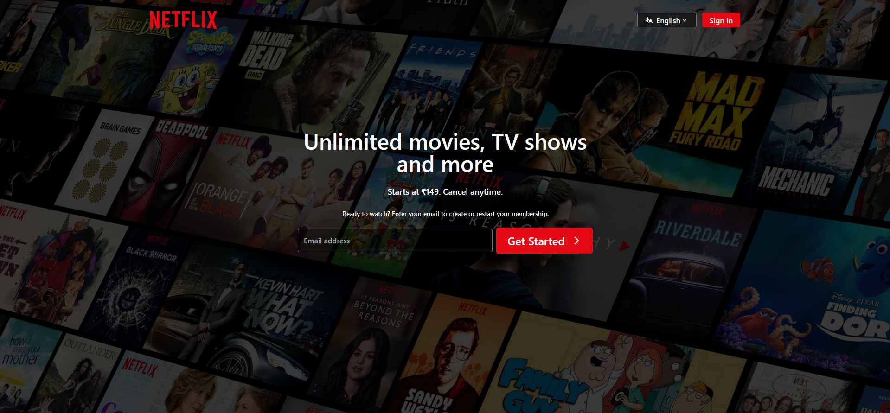
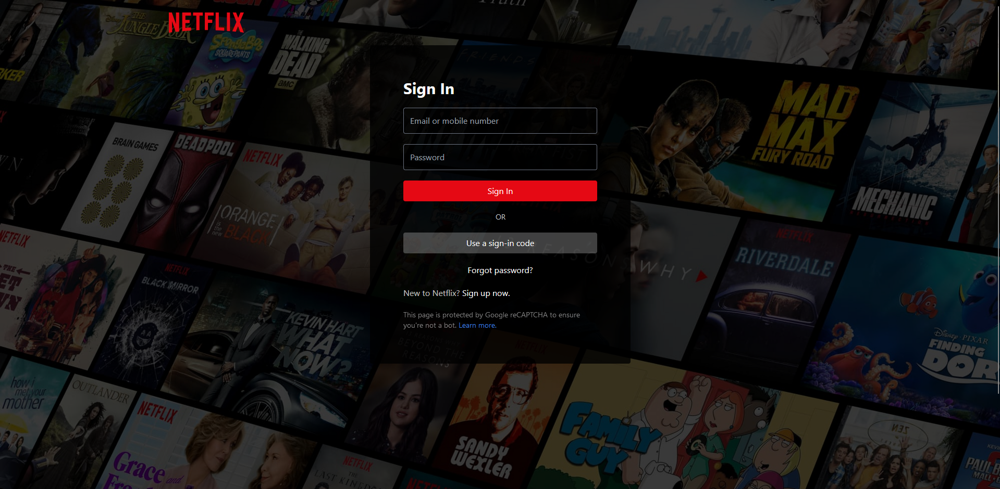

# Netflix Clone

This is a simple Netflix clone application built using React, TypeScript, Tailwind CSS, and Vite. The app features a home page displaying trending movies for the current week, along with a login page.

## Features

- Home page showcasing trending movies of the current week using the TMDB API.
- Login page for user authentication.
- Responsive design built with Tailwind CSS.
- TypeScript for enhanced type safety and developer experience.

## Technologies Used

- **React**: JavaScript library for building user interfaces.
- **TypeScript**: Superset of JavaScript that adds static types.
- **Tailwind CSS**: Utility-first CSS framework for rapid UI development.
- **Vite**: A fast build tool that provides a smooth development experience.
- **TMDB API**: Fetch movie data.

## Installation

To run this project locally, follow these steps:

1. Clone the repository:

   ```bash
   git clone https://github.com/MelvinThankachan/Netflix-Clone.git
   ```

2. Navigate to the project directory:

   ```bash
   cd Netflix-Clone
   ```

3. Install the dependencies:

   ```bash
   npm install
   ```

4. Create a `.env` file in the root directory and add your TMDB API key:

   ```bash
   TMDB_API_KEY=your_api_key_here
   ```

5. Start the development server:

   ```bash
   npm run dev
   ```

6. Open your browser and visit `http://localhost:5173`. (or the port specified in your terminal).

## Usage

Once the app is running, you can:

- View the home page with a list of trending movies.
- Navigate to the login page for user authentication.

## API Key

To obtain an API key from TMDB, sign up at [The Movie Database](https://www.themoviedb.org/) and create a new API key in your account settings.

## Screenshots





For more screenshots, please check the 'screenshots' folder.

## License

This project is licensed under the MIT License. See the [LICENSE](LICENSE) file for more details.

## Acknowledgements

- [TMDB API](https://developers.themoviedb.org/)
- [React](https://react.dev/)
- [TypeScript](https://www.typescriptlang.org/)
- [Tailwind CSS](https://tailwindcss.com/)
- [Vite](https://vitejs.)

free to replace any placeholder text or paths with actual images or details relevant to your project!
